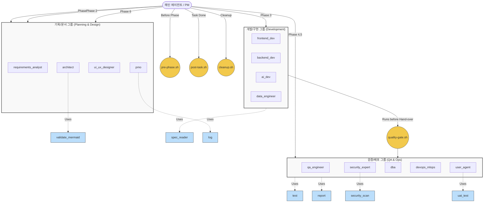

# Anchor AI 멀티 에이전트 하네스 (Anchor AI Multi-Agent Harness)

Antigravity 오케스트레이터를 위해 구축된 고도로 구조화된 플러그 앤 플레이 멀티 에이전트 개발 환경입니다. 이 하네스는 전적으로 자율적인 AI 에이전트들에 의해 주도되는 엔터프라이즈급 소프트웨어 개발 수명 주기(SDLC)를 강제하도록 설계되었습니다.

## 🚀 핵심 철학 (5대 원칙)
이 작업 공간의 모든 에이전트는 다음 규칙을 엄격하게 준수해야 합니다 (`.agents/AGENTS.md` 참조):
1. **절대적 자율성 (Absolute Autonomy)**: 사용자 개입이 없습니다. 에이전트들은 내부적으로 의존성을 해결합니다.
2. **스펙 주도 개발 (Spec-Driven Development)**: 맹목적인 코딩은 금지됩니다. 아키텍트가 스펙을 작성하고, PM이 이를 검증하며, 개발자가 이를 실행합니다.
3. **추적성 (Traceability)**: 모든 작업 및 코드 수정 사항은 실시간으로 블랙보드에 기록됩니다.
4. **사전 테스트 (Pre-Flight Testing)**: 개발자는 완료를 보고하기 전에 반드시 `/test` 스킬을 실행하여 빌드를 검증해야 합니다.
5. **엄격한 PM 승인 (Strict PM Sign-off)**: 프로젝트 관리자가 PRD(제품 요구사항 정의서)를 기준으로 승인하기 전까지는 아무것도 완료된 것이 아닙니다.

## 🤖 13명의 에이전트 명단 (The 13-Agent Roster)
이 시스템은 엄격하게 정의된 경계와 도구 권한을 가진 13명의 고도로 전문화된 에이전트로 구동됩니다.
- **기획 및 관리 (Planning & Management)**: `pm` (프로젝트 관리자), `pmo` (프로젝트 관리 오피스), `requirements_analyst` (요구사항 분석가)
- **설계 및 아키텍처 (Design & Architecture)**: `architect` (아키텍트), `ui_ux_designer` (UI/UX 디자이너)
- **개발 (Development)**: `frontend_dev` (프론트엔드 개발자), `backend_dev` (백엔드 개발자), `ai_dev` (AI 개발자), `data_engineer` (데이터 엔지니어)
- **검증 및 운영 (Review & Operations)**: `qa_engineer` (QA 엔지니어), `security_expert` (보안 전문가), `dba` (데이터베이스 관리자), `devops_mlops` (데브옵스/ML옵스)

### 🛡️ 결함 파이프라인 및 권한 제어
- **경로 차단**: 에이전트는 자신의 구성이나 시스템 규칙을 수정할 수 없습니다. 오직 `devops_mlops` 에이전트만이 자동화 스크립트를 수정할 수 있습니다.
- **PM 중심의 결함 파이프라인**: QA, 보안, UI/UX 또는 데브옵스 에이전트가 논리적 결함, 취약점 또는 빌드 오류를 발견하면 **직접 수정하지 않습니다**. 대신 `pm` 에이전트에게 직접 보고하며, `pm` 에이전트가 개발자에게 버그 수정 작업을 조율하고 할당합니다.

## 🏗️ 시스템 아키텍처 및 워크플로우 (System Architecture & Workflow)

이 시스템은 Phase 1부터 Phase 6까지의 엄격한 순차적 프로세스(Sequential Orchestration)를 따릅니다. 각 그룹의 에이전트는 자동화된 **훅(Hooks)**과 보조 도구인 **스킬(Skills)**을 통해 워크플로우를 통제받고 작업을 수행합니다.

### 시스템 연관관계 다이어그램


### 훅 (Hooks) - 자동화 및 게이트웨이 시스템
훅은 시스템 레벨에서 개입하여 각 Phase의 전제 조건과 품질을 강제하는 스크립트입니다.
- **`pre-phase.sh`**: 워크플로우 Phase 전환 시 선행 산출물 유무 및 소스 코드 여부를 폭넓게 검사합니다. 실패 시 파이프라인 진행을 차단합니다.
- **`quality-gate.sh`**: 정적 분석을 수행하여 기본 품질을 검증합니다. 프로젝트 루트에 `scripts/lint.sh`나 `Makefile`이 있으면 우선 실행하며(Convention over Configuration), 없으면 Java, Go, Node.js, Python 언어를 추론하여 기본 린터를 실행합니다.
- **`post-task.sh`**: 에이전트의 태스크 완료 후 호출되는 연쇄 트리거 훅입니다. `quality-gate.sh`를 동기적으로 실행하고 통과 시 `test` 스킬을 백그라운드로 돌리며, 완료 상태 로깅(`docs/blackboard.md`) 및 임시 파일을 정리합니다.
- **`cleanup.sh`**: 작업이 완료되거나 오류 종료될 때 불필요한 캐시 파일이나 임시 테스트 폴더 등을 정리(가비지 컬렉션)합니다.

### 스킬 (Skills) - 에이전트 전용 도구 모음
에이전트들이 특정 목적 달성을 위해 활용하는 능력이자 스크립트 모듈입니다.
- **`init`**: 프로젝트 및 작업 환경 초기화 (`docs/` 하위 폴더 생성, 블랙보드 초기화, `docs/context.md` 작성).
- **`log`**: 작업 상태와 이슈를 `docs/blackboard.md`에 통일된 양식으로 실시간 기록 (에이전트 작업 추적성 보장).
- **`spec_reader`**: 개발 전 기획서나 시스템 스펙 문서를 읽어들여 에이전트가 개발 컨텍스트를 파악할 수 있도록 돕습니다.
- **`test`**: 다국어(Java, Go, Node.js, Python) 프로젝트 타입을 감지하여 적합한 테스트 러너 실행 및 리포트를 자동 생성합니다. `scripts/test.sh` 파일이 있으면 오버라이드하여 우선 실행합니다.
- **`report`**: QA, 보안, UAT 작업 후 표준 보고서 마크다운 템플릿(`docs/reports/`)을 자동 생성합니다.
- **`security_scan`**: 취약점 점검을 위해 언어에 맞는 정적 보안 분석기(npm audit, bandit 등)를 실행하여 리포팅합니다 (Read-Only).
- **`uat_test`**: `user_agent` 전용 스킬로, 자율적인 앱 동적 탐색을 마친 뒤 모의 테스트 결과와 승인/반려(APPROVE/REJECT) 여부를 공식 리포트로 발행합니다.
- **`validate_mermaid`**: 아키텍트가 설계 다이어그램 작성 시 문법 오류를 `mmdc`를 통해 렌더링 시뮬레이션하여 사전 검증합니다.

## 🛠️ 시작하기 (Getting Started)

1. **리포지토리 클론 (Clone the Repository)**
   ```bash
   git clone https://github.com/ansungho22/anchor-ai.git
   cd anchor-ai
   ```

2. **환경 초기화 (Initialize the Environment)**
   에이전트 오케스트레이터를 통해 `init` 스킬을 트리거하여 작업 공간을 초기화하세요:
   ```bash
   # 이 명령어는 필요한 docs/ 디렉토리, 컨텍스트 파일 및 에이전트 블랙보드를 생성합니다.
   /init
   ```

3. **개발 시작 (Begin Development)**
   단순히 `requirements_analyst` 에이전트에게 초기 아이디어나 기능 요청을 제공하기만 하면, 파이프라인이 스스로 작동하는 것을 볼 수 있습니다!
