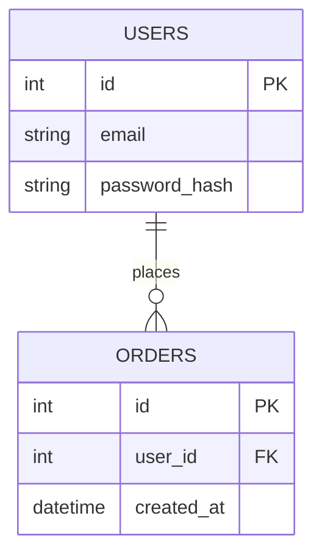

# 데이터베이스 스키마 설계 (Database Schema Design)

## 1. 개요 (Overview)
*데이터베이스의 주 사용 목적, 사용하는 DBMS 종류(PostgreSQL, MySQL, MongoDB 등), 버전 등을 기술하세요.*

## 2. ER 다이어그램 (ER Diagram)
*Mermaid 문법을 사용하여 핵심 테이블 간의 관계(Entity Relationship)를 시각화하세요.*

## 3. 테이블 명세 (Table Specifications)

### 3.1. USERS 테이블
| 컬럼명 | 데이터 타입 | 제약 조건 | 설명 |
|---|---|---|---|
| id | INT | PK, Auto Increment | 사용자 고유 식별자 |
| email | VARCHAR(255) | UNIQUE, NOT NULL | 사용자 이메일 (로그인 ID) |

### 3.2. [테이블 이름] 테이블
*추가 테이블 명세를 이곳에 작성하세요.*

## 4. 인덱스 및 제약 조건 (Indexes & Constraints)
*퍼포먼스 향상을 위한 인덱스 설정이나 트리거, 외부키 제약 조건 등 특이사항을 명시하세요.*
