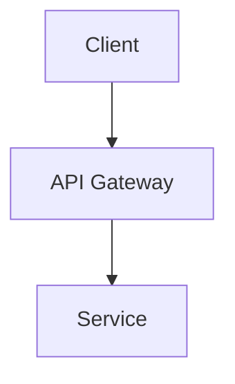
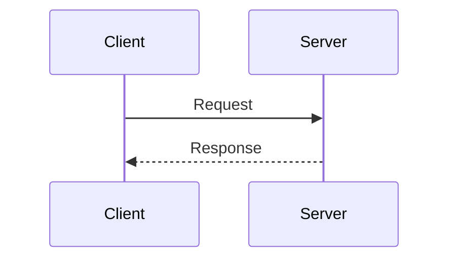

# 기술 스펙 및 아키텍처 문서 (Technical Specification)

## 1. 개요 (Overview)
- **목표:** [이 문서가 다루는 기술적 설계 범위]

## 2. 시스템 아키텍처 (System Architecture)
[Mermaid를 사용한 시스템 컴포넌트 다이어그램 추가]


## 3. 데이터베이스 스키마 (Database Schema)
- [테이블 명]: [설명]
  - `column1` (type): [설명]

## 4. API 명세서 (API Specification)
### `[메서드] /api/endpoint`
- **설명:** [API 목적]
- **Request:**
  ```json
  { "key": "value" }
  ```
- **Response:**
  ```json
  { "status": "success" }
  ```

## 5. 시퀀스 다이어그램 (Sequence Diagram)
[Mermaid를 사용한 상호작용 흐름 다이어그램 추가]

